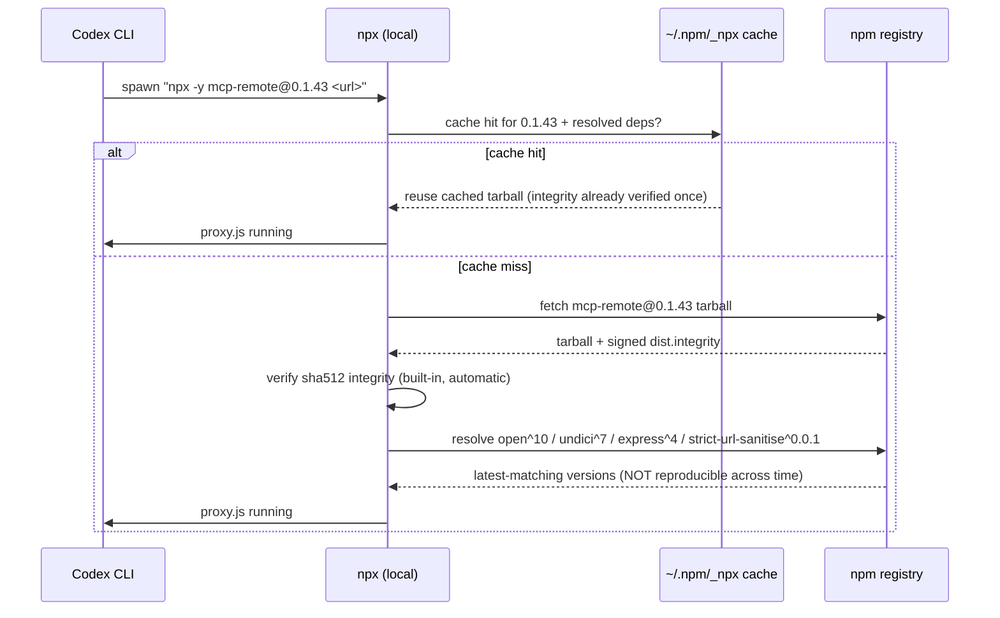
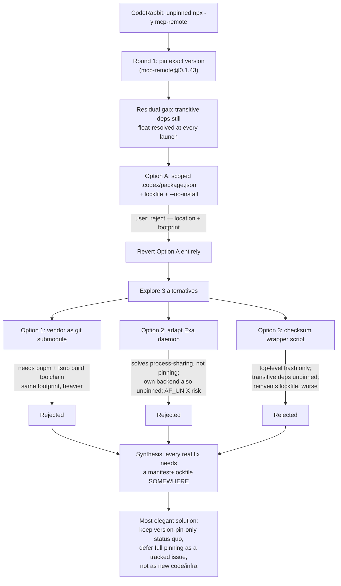

# mcp-remote Supply-Chain Pinning: Options Debate & Resolution (2026-08-22)

**Document Reference:** `.agent/memory/working/2026-08-22-mcp-remote-supply-chain-pinning-options-debate.md`
**Date:** 2026-08-22
**Related PR:** [`Perpetua-Tools#359`](https://github.com/diazMelgarejo/Perpetua-Tools/pull/359)
**File under debate:** `.codex/config.toml` — `[mcp_servers.exa]` entry
**Cross-References:**
- Semantic Decisions: `.agent/memory/semantic/DECISIONS.md`
- Prior session synthesis: `.agent/memory/working/SESSION_SYNTHESIS_SSRF_LAYER2_AND_FRUGAL_PYTHON_REUSE_2026-08-21.md`
- Existing submodule vendoring doctrine: `scripts/git/agentic-stack-vendor.md`, `.gitmodules`
- Existing daemon pattern investigated: `scripts/exa/exa-mcp-wrapper.sh`, `scripts/exa/exa-mcp-daemon.py`

---

## 1. Background

CodeRabbit flagged that `.codex/config.toml`'s Exa MCP server entry invoked `mcp-remote` via a
floating `npx -y mcp-remote` — no version pin, so every Codex CLI MCP-server launch resolves
whatever is currently published under that name, with no review gate. A prior attempt to defer
this as "pre-existing config, out of scope for this PR" was incorrect and reversed after
`git log --oneline <base>..HEAD -- .codex/config.toml` showed the file was touched in this
branch's own commit `1d8b0097` — see `[[git-log-verify-out-of-scope-claims]]` lesson.

**Fix, round 1 (shipped, committed):** pin the exact reviewed version —

```toml
args = ["-y", "mcp-remote@0.1.43", "https://mcp.exa.ai/mcp"]
```

This closed the "unbounded floating resolve" problem but left a narrower residual gap that
CodeRabbit's own comment (now embedded at `.codex/config.toml` lines 54-60) explicitly named:
*"This still isn't the full lockfile-backed, `--no-install`-enforced local executable a
stricter supply-chain posture would want."*

Two independent research/planning documents (uploaded 2026-08-22) proposed closing that gap and
asked to "implement the most elegant solution." What followed was three implementation rounds,
one user rejection, and a structured options debate — this document is the full record.

---

## 2. What "the residual gap" actually is

Even with the version pinned, `npx -y mcp-remote@0.1.43 <url>` still:

1. Hits the npm registry at MCP-server-launch time (unless already cached in `~/.npm/_npx`).
2. Resolves `mcp-remote@0.1.43`'s own **transitive dependencies**
   (`open@^10.1.0`, `undici@^7.12.0`, `express@^4.21.2`, `strict-url-sanitise@^0.0.1`) via
   floating semver ranges — those are **not** pinned by pinning `mcp-remote` itself.
3. Has no local, offline-runnable artifact — every launch is a live resolution event.

npm *does* verify the fetched tarball against the registry's signed `dist.integrity` metadata
over TLS automatically, so this is not an unguarded integrity hole — it is a
**reproducibility / deterministic-resolution** gap, not an active tampering vector.



---

## 3. Implementation round 1 — Option A (rejected by user)

**What was built:** a scoped `.codex/package.json` + `.codex/package-lock.json` declaring
`mcp-remote` as an exact-pinned dependency, invoked via
`npx --no-install --prefix .codex mcp-remote <url>` — verified end-to-end, including that
`--no-install` genuinely fails closed when the package isn't already installed.

**User response:** `"no"` — followed by clarification via `AskUserQuestion`:
**"Wrong approach for Gap 1 — undo it, let's discuss first."**

All Gap-1 files (`package.json`, `package-lock.json`, `node_modules/`) were reverted;
`.codex/config.toml` restored to the round-1 version-pin-only state.

**Two objections surfaced in discussion, confirmed explicitly by the user:**

1. **Location** — a second npm project living inside `.codex/` (a config directory, not a
   code/package directory).
2. **Footprint** — a new lockfile + `node_modules` tree materializing in this repo at all.

---

## 4. Three alternatives investigated (user-requested)

### 4.1 Option 1 — Vendor `mcp-remote` as a git submodule (repo's existing pattern)

The repo already vendors four upstream tools this way: `vendor/agentic-stack`,
`vendor/ecc-tools`, `vendor/Claude-Desktop-LLM`, `vendor/autoresearch` — each a git submodule
pinned to a commit/tag, documented in `.gitmodules` and `scripts/git/agentic-stack-vendor.md`.

**Investigation (verified live against upstream):**

- `github.com/geelen/mcp-remote` tag `v0.1.43` exists and matches the pinned npm version exactly
  (`git ls-remote --tags` confirmed).
- Cloned the tag: the source repo ships **no `dist/`** and **no npm lockfile** — it builds via
  `pnpm` (not npm) + `tsup` (`"build": "tsup"` in `package.json`).
- To run it from the submodule we would need `pnpm install && pnpm build` in CI/setup, i.e. a
  **second package manager** and a **build toolchain**, just to reproduce the `dist/proxy.js`
  that npm's registry already publishes pre-built.

**Verdict:** technically fits the repo's submodule *convention*, but the convention exists for
full applications developers customize in place (agentic-stack, ecc-tools) — not a thin CLI
dependency. Heavier than Option A for an identical end state (a built artifact + installed
`node_modules`), while also introducing `pnpm` as a new toolchain dependency.

### 4.2 Option 2 — Adapt the Exa daemon pattern ("Option B", creative exploration)

`scripts/exa/exa-mcp-wrapper.sh` + `scripts/exa/exa-mcp-daemon.py` already exist: a singleton
daemon bridging stdio ↔ a Unix domain socket, so all three Claude registrations
(Desktop/orama/PT) share one long-lived backend process instead of spawning N.

**Investigation (read both files in full):**

- The daemon's *own* backend call is `NPX, "-y", "exa-mcp-server"` — **also unpinned**. Routing
  `mcp-remote` through an equivalent daemon would not close any supply-chain gap; it would only
  relocate the identical problem to a different package name.
- Architecture depends on `socket.AF_UNIX` (Unix domain sockets) and a macOS Keychain fallback
  (`security find-generic-password`) for credential resolution (though the Keychain path is a
  *fallback* behind an env var / JSON-file check, so it isn't a hard blocker on its own).
- `AF_UNIX` support on Windows (this session's platform) is present since Windows 10 1803 but is
  inconsistent in sandboxed/CI environments — a real portability risk for zero pinning benefit.

**Verdict:** solves a *different* problem (process multiplexing, not supply-chain integrity).
Adapting it would add a socket-bridge + singleton-lifecycle layer with genuine cross-platform
risk, for no improvement over calling `npx` directly. Wrong tool for this finding.

### 4.3 Option 3 — Hand-rolled checksum/integrity wrapper script (no new `package.json`)

Proposal: a shell/node script that fetches the pinned tarball, verifies its hash against a
hardcoded `sha512-N2pGvTAPlHSH64iftgaVsR9J2+QUgCkTbaFb8XMxRbOFvJTCFONJOUNOxfnxPc0FUKyWUE/jpdhabfBI3g/gPw==`
(the actual published integrity for `mcp-remote@0.1.43`, confirmed via
`registry.npmjs.org/mcp-remote/0.1.43`), then execs `node` on the extracted result — no second
`package.json`.

**Investigation:**

- `mcp-remote@0.1.43` declares 4 direct runtime dependencies: `open@^10.1.0`, `undici@^7.12.0`,
  `express@^4.21.2`, `strict-url-sanitise@^0.0.1` — each with its own transitive tree.
- A hardcoded top-level integrity check covers **only** the `mcp-remote` tarball itself; the
  dependency tree beneath it still resolves dynamically at install time unless *those* are also
  pinned — which is precisely what a lockfile exists to do.
- Hand-rolling this duplicates lockfile mechanics with strictly less tooling support: no
  `npm audit`, no Dependabot coverage against a `package-lock.json`, more custom code to
  maintain and review.

**Verdict:** reinvents `package-lock.json`, worse and with more surface area.

---

## 5. Comparison table

| Dimension | Status quo (version pin only) | Option A (scoped `.codex/package.json`) | Option 1 (submodule) | Option 2 (daemon) | Option 3 (checksum wrapper) |
| --- | --- | --- | --- | --- | --- |
| New manifest/lockfile in repo | No | Yes | No (but new `pnpm-lock.yaml` reference, external) | No | No (but hand-rolled equivalent logic) |
| New `node_modules` footprint | No | Yes, under `.codex/` | Yes, under `vendor/mcp-remote/` | No (reuses existing daemon's `npx` call) | Yes, transient extraction dir |
| New toolchain dependency | None | None (npm only) | **Yes — `pnpm` + `tsup` build** | None | None |
| Pins transitive deps (`open`, `undici`, `express`, `strict-url-sanitise`) | No | Yes (lockfile) | Yes (upstream's own `pnpm-lock.yaml`, once built) | No — irrelevant, doesn't touch mcp-remote | Only if manually extended (not done) |
| Actually closes CodeRabbit's residual gap | No | Yes | Yes, in principle | **No — solves unrelated problem** | Partial / cosmetic |
| Cross-platform risk (this session: Windows) | None | None | Low (build tooling, not runtime) | **High (`AF_UNIX` reliability)** | None |
| Maintenance burden going forward | None (npm handles registry integrity automatically) | Lockfile bump on version changes | Submodule bump + rebuild step | New daemon code to own | Hand-rolled hash list to keep current, manually, per dependency |
| User objections satisfied (location / footprint) | Yes / Yes | No / No | Yes / **No** | Yes / Yes (but wrong problem) | Yes / **No** (still materializes files) |

---

## 6. Decision tree



---

## 7. Consequences of the final direction (status quo retained)

**What stays:**

```toml
[mcp_servers.exa]
command = "npx"
args = ["-y", "mcp-remote@0.1.43", "https://mcp.exa.ai/mcp"]
startup_timeout_sec = 30
```

with its existing explanatory comment already documenting the deferral rationale.

**Accepted:**
- npm's automatic `dist.integrity` verification (TLS + signed sha512 per fetch) remains the de
  facto protection for the pinned top-level package.
- Transitive dependency drift (`open`, `undici`, `express`, `strict-url-sanitise`) remains
  possible between launches when the npx cache is cold — accepted residual risk, not a silent
  gap: it is now fully documented here and in the file's own comment.
- No new build toolchain (`pnpm`), no new daemon/socket architecture, no new lockfile, no new
  `node_modules` anywhere in this repo as a result of this specific finding.

**Rejected paths, and why, are preserved above** so a future session does not re-derive Options
1–3 from scratch and re-spend the same investigation budget.

**Deferred, not abandoned:** CodeRabbit offered (twice, on this PR's review thread) to open a
GitHub tracking issue for the full lockfile-backed fix. That offer is the correct next step if
this gap is ever prioritized — record the decision and rationale in an issue, not in new
repo infrastructure. As of this document, that issue has **not** been created; still awaiting
explicit operator go-ahead (tracked alongside the other pending CodeRabbit-offered issue, the
git-stash TDD retroactive-verification test coverage gap — see prior session synthesis, § cross
references above).

---

## 8. Standing debate status

**Open / not fully closed:** this document records the *investigation and rejection* of Options
A, 1, 2, and 3, and the *recommended* resting state (status quo + optional tracking issue). It
does **not** record a final explicit "yes, stop here" from the operator — only that no further
implementation was requested after the three-option comparison was presented. If a future
session revisits this, re-read this file before re-proposing any of Options A/1/2/3; each was
investigated concretely (not just discussed abstractly) and found to reduce to the same
trade-off: real transitive-dependency pinning requires a manifest+lockfile living *somewhere*,
and no location/toolchain investigated avoids that requirement.
