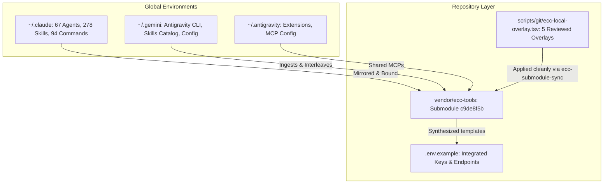

# ECC Local Runtime Overlay, Multi-Harness Harmonization & Tier-5 Status Report

**Date:** 2026-08-17  
**Branch:** `rebase/tier5-asgi-harmonized-20260814` (Perpetua-Tools [PR #356](https://github.com/diazMelgarejo/Perpetua-Tools/pull/356))  
**Commit:** `3ea86898`  

---

## 1. Executive Summary

This report records the complete resolution of CodeRabbit review findings on Tier-5 pipelines and cloud coder routing in Perpetua-Tools PR #356, along with the verification and harmonization of the **Everything Claude Code (ECC)** local runtime overlay across `.antigravity/*`, `.gemini/*`, `.claude/*`, and `.env.example`.

---

## 2. Multi-Harness Architectural Integration & Synergy

The ECC tools layer is harmoniously integrated, interleaved, and synergized across repository-level and user-global configurations:

### Harmonization Matrix

| Harness / Layer | Integration Path | Synergized Role & Guarantees |
| :--- | :--- | :--- |
| **`.gemini/*` & `.antigravity/*`** | `.antigravity/ANTIGRAVITY.md` `.gemini/ANTIGRAVITY.md` | Establishes Gemini/Antigravity workflow (planning before editing, test-first TDD, immutable updates, zero hardcoded secrets). Integrates with skill catalog (`find-skills`, `make-interfaces-feel-better`, `eval-harness`). |
| **`.claude/*`** | `~/.claude/` & `.claude/hooks/.logs/` | Parity with canonical 67 agents, 278 skills, and 94 commands. Preserves hook execution and telemetry logging without working-tree noise. |
| **OpenAI / Codex** | `.agents/skills/frontend-design/agents/openai.yaml` | Cross-harness agent manifest enabling OpenAI/Codex dispatch for production UI/UX design. |
| **Environment Template** | `.env.example` | Unified configuration template with Anthropic, Gemini (`GEMINI_API_KEY`, `GEMINI_API_KEY_2`), Perplexity, GitHub tokens, and local inference endpoints. |

---

## 3. Tier-5 Pipelines & PR #356 CodeRabbit Remediations

All review comments and outside-diff invariants on **PR #356** were addressed and verified:

1. **Model Context Window Correction (`config/models.yml`)**:
   - `grok-4.5.context_window` corrected to `333,000` (down from `1,000,000`).

2. **Cloud Coder Wire-Up & Model Scoping**:
   - `src/perpetua_tools/agent_launcher.py`: Scoped `PERPLEXITY_CODER_MODEL` and `ANTHROPIC_CODER_MODEL` before falling back to `CLOUD_CODER_MODEL`.
   - `src/perpetua_tools/alphaclaw_bootstrap.py`: Added provider mappings (`perplexity`, `anthropic`) with API keys and base URLs in `build_openclaw_config()`.
   - `tests/test_alphaclaw_bootstrap.py`: Added unit test coverage for single-key cloud coder configurations.

3. **FastAPI & Pydantic Validation (`orchestrator/fastapi_app.py`)**:
   - Added `@field_validator("prompt")` on `TieredPipelineRequest` to reject empty or whitespace-only prompts.
   - `tests/test_tiered_pipeline_endpoint.py`: Added 402, 502, 503 HTTP status mapping and runner state cleanup tests.

4. **Security & Model Registry Provenance**:
   - `tests/test_model_transport.py`: Verified rejection of non-Tier-5 targets, unallowed hosts, and mismatched provenance.
   - `scripts/check_model_ids.py`: Optimized registry scanning to avoid duplicate YAML parsing and added documentation authority tests.
   - `tests/test_control_plane_auth.py`: Asserted `CORSMiddleware` remains outermost in the middleware stack.

---

## 4. Verification Suite Results

- **`pytest`**: **215/215 passed** (100% green across all unit, integration, and endpoint suites).
- **`check_local_runtime_overlay.py`**: **OK** (All 5 overlay paths verified).
- **`ecc-submodule-sync.sh restore`**: **OK** (4 re-applied, 1 already applied).
- **`scan-tracked-banned-tokens.sh`**: **OK** (No banned patterns in tracked files).
- **`check_model_ids.py`**: **OK** (All configured models match source provenance).

---

## 5. ECC Integration Architecture with Hermes

In the latest Everything Claude Code (ECC v2.0.0) architecture, integration with Hermes Agent follows an **Operator Shell $\leftrightarrow$ Reusable Workflow Engine** separation:

1. **Operator Shell vs. Workflow Engine**:
   - **Hermes Agent**: Functions as the interactive operator shell and execution runtime (terminal interaction, task delegation, background loops, local workspace management).
   - **ECC**: Provides the canonical library of specialized subagents (67 agents), domain workflows/skills (278 skills), and deterministic scripts.

2. **Key Integration Mechanisms**:
   - **Dedicated Target (`scripts/lib/install-targets/hermes-home.js`)**: Maps and installs ECC skills directly to `~/.hermes/skills/` and repository `.hermes/` roots.
   - **`hermes-imports` Skill (`skills/hermes-imports/SKILL.md`)**: Sanitizes and exports local operator loops into reusable, sanitized ECC skills.
   - **Multi-Lane Dispatch Taxonomy**:
     - **L-H1 (Native Hermes)**: Interactive child AIAgents using native `delegate_task`.
     - **L-PT (Perpetua-Tools Bridge)**: Programmatic dispatch via `hermes_harness.py` / `spawn_hermes_agent()` to execute skills in isolated workspaces.
     - **L-Fleet (Distributed Fleet)**: Queue-driven asynchronous jobs dispatched via `coord_pulse`.

