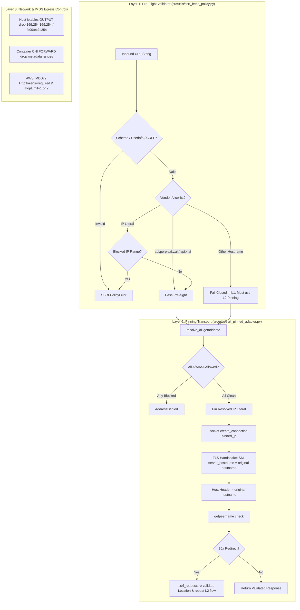

# SESSION SYNTHESIS: SSRF LAYER-2 PINNED TRANSPORT & FRUGAL PYTHON PATH REUSE (2026-08-21)

**Document Reference:** `.agent/memory/working/SESSION_SYNTHESIS_SSRF_LAYER2_AND_FRUGAL_PYTHON_REUSE_2026-08-21.md`  
**Date:** 2026-08-21  
**Author:** Antigravity / Gemini 3.7 Flash High  
**Methodology:** `oramasys-method` (AFRP Type C | Level Expert | Mode 3)  
**Branches:**
- `Perpetua-Tools`: `fix/pt-standards-convergence-20260818` (PR #359)
- `orama-system`: `fix/markdownlint-doc53-ci-20260820` (PR #321)  
**Cross-References:**
- Layer-1 Pre-Flight SSOT: `src/utils/ssrf_fetch_policy.py`
- Layer-2 Pinning Adapter: `src/utils/ssrf_pinned_adapter.py`
- Layer-2 Unit Tests: `tests/test_ssrf_pinned_adapter.py`
- Hardening Checklists: `docs/plans/2026-08-21-pt-endpoint-hardening-checklists.md`
- Orama Plan: `orama-system:docs/v2/plans/2026-08-20-ssrf-defense-in-depth.md`
- Semantic Decisions: `.agent/memory/semantic/DECISIONS.md`
- Episodic Stream: `.agent/memory/episodic/AGENT_LEARNINGS.jsonl`

---

## 1. Executive Summary

During this session, we reviewed the deep research report `Defense-in-Depth SSRF Prevention in 2025-2026: Limits of Application-Layer Python Validators.md` and implemented and tested the SSRF Layer-2 transport hardening entirely in `Perpetua-Tools` (see Deliverables Matrix, § 4); `orama-system` received a companion architecture spec/runbook doc only (`docs/v2/plans/2026-08-20-ssrf-defense-in-depth.md`), not implementation or tests.



---

## 2. Core Security Insights & The Three-Layer Architecture

### 2.1 The Limits of Pre-Flight String Validation
As proven across 2025-2026 CVEs (CVE-2026-27826 TOCTOU in MCP-Atlassian, CVE-2026-53708, CVE-2026-53945, CVE-2026-27795 redirect in LangChain.js, CVE-2026-35459 in pyLoad):
1. **DNS Rebinding (TOCTOU)**: Pre-flight validator resolves hostname to a public IP, but the underlying HTTP client re-resolves the hostname at connection time to `169.254.169.254` or RFC1918.
2. **Redirect Bypasses**: A legitimate public URL responds with `302 Found` pointing to `http://169.254.169.254/latest/meta-data/`. A pre-flight check never sees the redirect target.
3. **Multicast Quirk**: Python stdlib `ipaddress.is_global` returns `True` for multicast addresses (e.g. `224.0.0.1`, SSDP `239.255.255.250`) — reproducing ssrfcheck CVE-2025-8267 if not explicitly guarded.

### 2.2 Layer-2 Technical Solution: Connection-Time Pinning
In `src/utils/ssrf_pinned_adapter.py`:
- `resolve_all()` inspects **every** A/AAAA record returned by `socket.getaddrinfo`. If even one IP is internal/link-local/multicast/CGNAT/IMDS, the entire domain is rejected.
- Custom connection pools (`_PinnedHTTPConnectionPool`, `_PinnedHTTPSConnectionPool`) override `_new_conn()` to dial `socket.create_connection((pinned_ip, port))`.
- TLS SNI (`server_hostname`, `assert_hostname`) and the `Host` header retain the original domain name, preserving valid certificate validation.
- `getpeername()` is inspected post-connection as an additional safety net.
- Automatic redirects are refused in `send()`; `ssrf_request()` manually executes each hop, parsing `Location`, normalizing via `urljoin()`, re-running URL and IP validation, and capping hops at 3.

---

## 3. Strategy for Frugal Reuse of Existing Python Paths

A major insight from our multi-agent pairing and environment inspection:

### 3.1 Zero-Dependency & stdlib Maximization
- Avoid adding third-party security packages (`dssrf`, archived `safeurl-python`) which frequently suffer rapid CVE churn or unmaintained codebases.
- Build upon standard, rock-solid libraries already in the runtime: `requests.adapters.HTTPAdapter`, `urllib3`, `ipaddress`, `socket`, `urllib.parse`.

### 3.2 Dual-Try Path & Import Normalization
In diverse environments (monorepos, subpackages, IDE test discovery, direct CLI execution), imports can resolve as `src.utils.*` or `utils.*`. We implemented the **dual-try fallback pattern** in `hook_endpoint_policy()`:
```python
try:
    from src.utils.ssrf_fetch_policy import assert_address_allowed, assert_url_allowed
    return assert_address_allowed, assert_url_allowed
except (ImportError, AttributeError):
    try:
        from utils.ssrf_fetch_policy import assert_address_allowed, assert_url_allowed
        return assert_address_allowed, assert_url_allowed
    except (ImportError, AttributeError):
        pass
# Fallback to local defaults
return default_address_allowed, default_url_allowed
```

### 3.3 Strict Isolation of Polarities
- Outbound User URL Fetching (`src/utils/ssrf_fetch_policy.py` + `ssrf_pinned_adapter.py`): **Deny-by-default** on private, loopback, link-local, CGNAT, multicast, IMDS.
- Inbound / Local Model Discovery (`src/utils/model_endpoint_url.py`): **Allowlist** for trusted LAN/loopback servers (Ollama, LM Studio, vLLM).
- These two domains must remain decoupled and never unified into a single ambiguous validator.

---

## 4. Deliverables Matrix

| Repository | Branch | File | Role |
| :--- | :--- | :--- | :--- |
| `Perpetua-Tools` | `fix/pt-standards-convergence-20260818` | `src/utils/ssrf_pinned_adapter.py` | Layer-2 Pinned Adapter |
| `Perpetua-Tools` | `fix/pt-standards-convergence-20260818` | `src/utils/ssrf_fetch_policy.py` | Layer-1 SSOT + Adapter Hooks |
| `Perpetua-Tools` | `fix/pt-standards-convergence-20260818` | `tests/test_ssrf_pinned_adapter.py` | Unit Test Suite |
| `Perpetua-Tools` | `fix/pt-standards-convergence-20260818` | `docs/plans/2026-08-21-pt-endpoint-hardening-checklists.md` | PR & Operator Checklists |
| `orama-system` | `fix/markdownlint-doc53-ci-20260820` | `docs/v2/plans/2026-08-20-ssrf-defense-in-depth.md` | Architecture Spec & Runbook |
