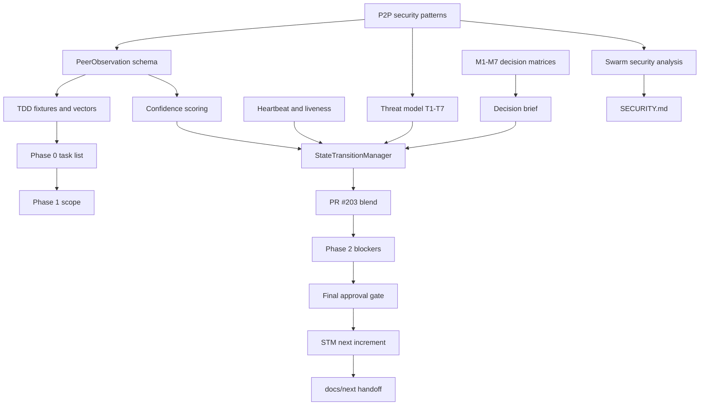

# Phase 0 Specifications

> **This is STM / swarm security Phase 0** — PeerObservation, StateTransitionManager,
> threat T1–T7, mesh *evidence*. **Not** coordination **Phase 0F** (CLI freeze).
> Disambiguation:
> [`docs/coordination/PHASE-0-TERMINOLOGY-DISAMBIGUATION.md`](../coordination/PHASE-0-TERMINOLOGY-DISAMBIGUATION.md)
> · Coordination hub:
> [`docs/coordination/README.md`](../coordination/README.md)

This folder is the Phase 0 knowledge graph for the Perpetua-Tools swarm and
StateTransitionManager work. It is not one plan repeated many times. It is a
layered record of how the system moved from P2P security research, to TDD
contracts, to STM reconciliation, to multi-agent review, to the v1-to-v2
security and coordination handoff.

Read this page first, then use the LLM-wiki pages under [`wiki/`](wiki/) for
file nodes, concept nodes, and explicit edges.

**Penultimate pre-v2 checklist (every plan disposition):**
[`PHASE-0-MASTER-PLAN-2026-07-27.md`](PHASE-0-MASTER-PLAN-2026-07-27.md)

## Root-Cause Reading

The root problem behind these documents is that useful peer-orchestration
ideas existed as separate modules, tests, and review findings, but the product
needed a single decision boundary. Phase 0 discovered that append-only peer
observations, confidence scoring, liveness checks, replay protection, witness
quorum, and threat-model controls only become operationally meaningful when
they converge into a state-transition owner with bounded queues, explicit
failure semantics, and production wiring.

In first-principles terms:

- A peer report is evidence, not state.
- State changes need a monotonic decision boundary.
- Liveness and confidence are coupled; neither is sufficient alone.
- BFT-style patterns must be sized to the actual deployment premise.
- Multi-agent work needs source-of-truth discipline, or review findings
  become branch drift and duplicated fixes.

## Reading Order

| Order | Start here | Why |
| --- | --- | --- |
| 1 | [`PATTERN-SYNTHESIS.md`](PATTERN-SYNTHESIS.md) | Extracts the reusable P2P security patterns that seeded Phase 0. |
| 2 | [`DELIVERABLE-1-PEER-OBSERVATION-MODEL-REGENERATED-ITERATION-2.md`](DELIVERABLE-1-PEER-OBSERVATION-MODEL-REGENERATED-ITERATION-2.md) | Canonical repaired PeerObservation and confidence model. |
| 3 | [`DELIVERABLE-2-HEARTBEAT-LIVENESS-REGENERATED.md`](DELIVERABLE-2-HEARTBEAT-LIVENESS-REGENERATED.md) | Liveness, timeout hierarchy, and hysteresis expectations. |
| 4 | [`DELIVERABLE-4-THREAT-MODEL-REGENERATED.md`](DELIVERABLE-4-THREAT-MODEL-REGENERATED.md) | Threat IDs and adversarial controls used by later plans. |
| 5 | [`PHASE-0-FIX-3-AND-MEDIUM-ITEMS-DECISION-BRIEF.md`](PHASE-0-FIX-3-AND-MEDIUM-ITEMS-DECISION-BRIEF.md) | Reconciles STM model conflicts and medium-risk decisions. |
| 6 | [`2026-07-11-state-transition-manager-integration-plan.md`](2026-07-11-state-transition-manager-integration-plan.md) | Converts separate evidence modules into one STM pipeline. |
| 7 | [`README-PR203-BLEND.md`](README-PR203-BLEND.md) | Navigation hub for the PR #203 blend and next-agent handoff. |
| 8 | [`2026-07-12-autoplan-final-approval-gate.md`](2026-07-12-autoplan-final-approval-gate.md) | Final approval gate for the Phase 2 STM concurrency/dedup increment. |
| 9 | [`2026-07-12-stm-next-increment-plan.md`](2026-07-12-stm-next-increment-plan.md) | Closed plan for threat-model re-check, production wiring, and hardening. |

## Concept Map

## Main File Clusters

| Cluster | Files | Meaning |
| --- | --- | --- |
| Pattern research | [`PATTERN-SYNTHESIS.md`](PATTERN-SYNTHESIS.md), [`PATTERN-MULTIAGENT-EXECUTION-PLAN.md`](PATTERN-MULTIAGENT-EXECUTION-PLAN.md), [`MULTIAGENT-SWARM-SECURITY-ANALYSIS.md`](MULTIAGENT-SWARM-SECURITY-ANALYSIS.md) | Imports distributed-systems patterns, then filters them through OpenClaw swarm security needs. |
| Core contracts | [`DELIVERABLE-1-PEER-OBSERVATION-MODEL-EXPANDED.md`](DELIVERABLE-1-PEER-OBSERVATION-MODEL-EXPANDED.md), [`DELIVERABLE-1-PEER-OBSERVATION-MODEL-REGENERATED-ITERATION-2.md`](DELIVERABLE-1-PEER-OBSERVATION-MODEL-REGENERATED-ITERATION-2.md), [`peer_observation_tdd.md`](peer_observation_tdd.md) | Defines the evidence envelope, confidence formula, schema immutability, and fixtures. |
| Runtime safety | [`DELIVERABLE-2-HEARTBEAT-LIVENESS-REGENERATED.md`](DELIVERABLE-2-HEARTBEAT-LIVENESS-REGENERATED.md), [`DELIVERABLE-4-THREAT-MODEL-REGENERATED.md`](DELIVERABLE-4-THREAT-MODEL-REGENERATED.md), [`MEDIUM-ITEMS-DECISION-MATRICES.md`](MEDIUM-ITEMS-DECISION-MATRICES.md) | Liveness, replay, rate limits, dedup, quorum, and threat semantics. |
| STM integration | [`2026-07-11-state-transition-manager-integration-plan.md`](2026-07-11-state-transition-manager-integration-plan.md), [`2026-07-11-phase1b-integration-review.md`](2026-07-11-phase1b-integration-review.md), [`2026-07-12-stm-remediation-plan.md`](2026-07-12-stm-remediation-plan.md) | Turns independently valid modules into a single state-transition pipeline. |
| Review and execution | [`2026-07-11-pr203-multiagent-orchestration.md`](2026-07-11-pr203-multiagent-orchestration.md), [`2026-07-11-PR203-BLEND-VERDICT.md`](2026-07-11-PR203-BLEND-VERDICT.md), [`README-PR203-BLEND.md`](README-PR203-BLEND.md), [`2026-07-12-autoplan-final-approval-gate.md`](2026-07-12-autoplan-final-approval-gate.md) | Records how agents reconciled competing patches, reviews, and approval gates. |
| Handoff | [`PHASE-1-SCOPE-DRAFT.md`](PHASE-1-SCOPE-DRAFT.md), [`PHASE-2-JOB-BOARD.md`](PHASE-2-JOB-BOARD.md), [`2026-07-12-stm-next-increment-plan.md`](2026-07-12-stm-next-increment-plan.md) | Connects Phase 0 contracts to Phase 1 and Phase 2 implementation work. |

## Wiki Pages

| Page | Use it for |
| --- | --- |
| [`wiki/files.md`](wiki/files.md) | File-by-file node inventory and downstream role. |
| [`wiki/concepts.md`](wiki/concepts.md) | Concept dictionary with primary source files. |
| [`wiki/edges.md`](wiki/edges.md) | Explicit source-to-target node relationships. |
| [`wiki/security-trace.md`](wiki/security-trace.md) | Threat, liveness, dedup, and policy links into security docs. |

## External Handoff Links

- Current operational queue and gates:
  [`../next/2026-08-14-operational-work-disposition.md`](../next/2026-08-14-operational-work-disposition.md)
- Forward-looking PT work: [`../next/README.md`](../next/README.md)
- PT security policy: [`../../SECURITY.md`](../../SECURITY.md)
- Orama companion security policy:
  [`orama-system/SECURITY.md`](https://github.com/diazMelgarejo/orama-system/blob/main/SECURITY.md)
- Orama v2 security foundation:
  [`docs/v2/31-security-harness-excellence-plan.md`](https://github.com/diazMelgarejo/orama-system/blob/main/docs/v2/31-security-harness-excellence-plan.md),
  [`docs/v2/32-agentic-security-controls.md`](https://github.com/diazMelgarejo/orama-system/blob/main/docs/v2/32-agentic-security-controls.md),
  [`docs/v2/39-maestro-owasp-genai-reference.md`](https://github.com/diazMelgarejo/orama-system/blob/main/docs/v2/39-maestro-owasp-genai-reference.md)
