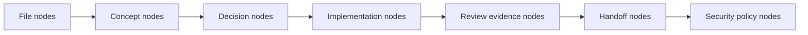
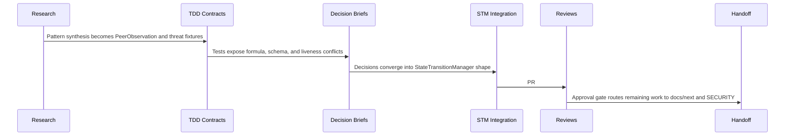

# Phase 0 LLM Wiki

This wiki turns `docs/phase-0-specifications/` into a graph an agent can query
without rereading every plan. The root page is [`../README.md`](../README.md);
this folder holds the node and edge analysis.

## Node Types

| Node type | Examples | Wiki page |
| --- | --- | --- |
| File | `PATTERN-SYNTHESIS.md`, `PHASE-0-TASK-LIST.md` | [`files.md`](files.md) |
| Concept | PeerObservation, STM, replay dedup, hysteresis | [`concepts.md`](concepts.md) |
| Edge | "defines", "tests", "supersedes", "gates", "hands off to" | [`edges.md`](edges.md) |
| Security trace | T1-T7, P5/P6/P13, LAN premise, policy sync | [`security-trace.md`](security-trace.md) |

## High-Level Flow

## Operating Interpretation

The strongest reading is not "implement every old line item." It is:

1. Preserve the evidence envelope and confidence model.
2. Keep the STM as the monotonic security decision boundary.
3. Wire only controls that match the current deployment premise.
4. Defer multi-site or adversarial mesh claims until v2 has explicit product
   requirements and operator visibility.
5. Keep review packs as evidence, not as competing sources of truth.
