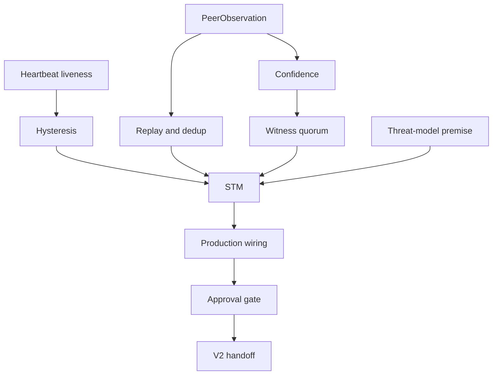

# Concept Nodes

| Concept | Meaning | Primary files |
| --- | --- | --- |
| PeerObservation | Immutable evidence envelope for peer status reports. | [`DELIVERABLE-1-PEER-OBSERVATION-MODEL-REGENERATED-ITERATION-2.md`](../DELIVERABLE-1-PEER-OBSERVATION-MODEL-REGENERATED-ITERATION-2.md), [`peer_observation_tdd.md`](../peer_observation_tdd.md) |
| Confidence scoring | Multiplicative confidence formula that weighs observer, freshness, consistency, and evidence quality. | [`DELIVERABLE-1-PEER-OBSERVATION-MODEL-REGENERATED-ITERATION-2.md`](../DELIVERABLE-1-PEER-OBSERVATION-MODEL-REGENERATED-ITERATION-2.md), [`TASK_A2_FINDINGS.md`](../TASK_A2_FINDINGS.md) |
| Hysteresis | Promotion/demotion stability so peer state does not flap. | [`DELIVERABLE-2-HEARTBEAT-LIVENESS-REGENERATED.md`](../DELIVERABLE-2-HEARTBEAT-LIVENESS-REGENERATED.md), [`PHASE-1-SCOPE-DRAFT.md`](../PHASE-1-SCOPE-DRAFT.md) |
| StateTransitionManager | Central decision boundary that converts evidence into monotonic peer state changes. | [`2026-07-11-state-transition-manager-integration-plan.md`](../2026-07-11-state-transition-manager-integration-plan.md), [`2026-07-12-stm-next-increment-plan.md`](../2026-07-12-stm-next-increment-plan.md) |
| Witness quorum | Multiple observers support or reject a state transition. | [`PATTERN-SYNTHESIS.md`](../PATTERN-SYNTHESIS.md), [`PHASE-1-SCOPE-DRAFT.md`](../PHASE-1-SCOPE-DRAFT.md) |
| Replay and dedup | Prevents repeated, stale, or out-of-order observations from mutating state twice. | [`DELIVERABLE-4-THREAT-MODEL-REGENERATED.md`](../DELIVERABLE-4-THREAT-MODEL-REGENERATED.md), [`2026-07-11-PHASE-2-BLOCKERS.md`](../2026-07-11-PHASE-2-BLOCKERS.md) |
| Bounded backpressure | Caps buffers, queues, caches, and peer cardinality so adversarial or noisy inputs cannot grow memory forever. | [`MEDIUM-ITEMS-DECISION-MATRICES.md`](../MEDIUM-ITEMS-DECISION-MATRICES.md), [`2026-07-12-autoplan-final-approval-gate.md`](../2026-07-12-autoplan-final-approval-gate.md) |
| Threat-model premise | Explicit check that security controls match the actual operator-owned LAN now, not only a future permissionless mesh. | [`2026-07-12-ceo-review-quad-voices/00-README.md`](../2026-07-12-ceo-review-quad-voices/00-README.md), [`2026-07-12-stm-next-increment-plan.md`](../2026-07-12-stm-next-increment-plan.md) |
| Production wiring | The point where tested security code is invoked by real ingestion paths rather than only tests. | [`2026-07-11-phase1b-integration-review.md`](../2026-07-11-phase1b-integration-review.md), [`2026-07-12-stm-remediation-plan.md`](../2026-07-12-stm-remediation-plan.md) |
| Multi-agent blend | Method for resolving parallel agent lineages without losing valid work or trusting stale worktrees. | [`2026-07-11-PR203-BLEND-VERDICT.md`](../2026-07-11-PR203-BLEND-VERDICT.md), [`README-PR203-BLEND.md`](../README-PR203-BLEND.md) |
| Approval gate | Final check that review findings, rescue registries, and failure modes are closed or deliberately deferred. | [`2026-07-12-autoplan-final-approval-gate.md`](../2026-07-12-autoplan-final-approval-gate.md) |
| V2 handoff | The route from Phase 0/1 STM findings to future mesh, security, and coordination docs. | [`docs/next`](../../next/README.md), [`../../../SECURITY.md`](../../../SECURITY.md) |

## Concept Dependency Diagram

